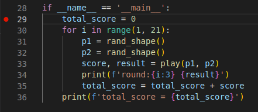

Debugging is an essential task in programming that is often required. It involves meticulously examining a program step by step in order to identify the source of an error. When it comes to debugging Python code, it is typically prompted by an unexpected behavior or malfunctioning of the program.

<!--truncate-->

## [0] Prerequisites

### [0.1] Install the Python extension in VSCode

Ensure you have the Python extension installed in Visual Studio Code. You can do this by going to the Extensions view (click the square icon on the left sidebar) and searching for `Python.` Choose the official Python extension by Microsoft and click the install button.


### [0.2] Create a launch configuration file
VSCode uses launch configurations to specify how to start and run your program in the debugger. To create a launch configuration file, click on the Run view (the bug icon on the left sidebar), and then click on the gear icon (or select `create a launch.json file`) to create a new launch configuration.


If you already have a launch.json file, skip this step.

### [0.3] Choose a debug configuration
In the `Select Environment` dropdown, choose `Python` as the debug environment. VSCode will generate a basic `launch.json` file with a default configuration for debugging Python.


### [0.4] Configure your launch configuration
The generated `launch.json` file should be open in the editor. Modify the `program` attribute to point to the entry point of your Python script, i.e., the file you want to debug.

If your Python file takes command-line arguments, you can add them to the `args` list in the launch configuration.


## [1] Initial Python code
```python
'''
rock paper scissors simulation
'''
import random


def rand_shape():
    d = {"r": "rock", "p": "paper", "s": "scissors"}
#    d = {"r": "\u270a", "p": "\u270b", "s": "\u270c"}
    return random.choice(list(d.values()))


def play(shape1, shape2):
    score = 0
    if shape1 == shape2:
        result = f'{shape1:8} = {shape2}'
    elif (shape1 == "rock" and shape2 == "scissors") \
            or (shape1 == "paper" and shape2 == "rock") \
            or (shape1 == "scissors" and shape2 == "paper"):
        result = f'{shape1:8} > {shape2}'
        score = 1
    else:
        result = f'{shape1:8} < {shape2}'
        score = -1
    return score, result


if __name__ == '__main__':
    total_score = 0
    for i in range(1, 21):
        p1 = rand_shape()
        p2 = rand_shape()
        score, result = play(p1, p2)
        print(f'round:{i:3} {result}')
        total_score = total_score + score
    print(f'total_score = {total_score}')
```

## [2] Debugging

### [2.1] Set breakpoints

Set breakpoints in your Python code by clicking in the gutter (the area to the left of the line numbers) or by using the shortcut `F9`. Breakpoints are markers that tell the debugger to pause execution at a specific line.



### [2.2] Start debugging

To start debugging, either press the `F5` key or click the green play button in the Debug view.

If you've set breakpoints, the debugger will pause execution at the first breakpoint it encounters. You can then step through the code line by line, examine variables, and explore the program's state.


### [2.3] Debugging controls
While debugging, you have access to several controls in the debug toolbar. Here are a few commonly used controls:

* `Continue (F5)`: Continue execution until the next breakpoint or until the program completes.
* `Step Over (F10)`: Execute the current line and move to the next line. If the current line contains a function call, it will execute the entire function and pause at the next line.
* `Step Into (F11)`: Execute the current line, and if it is a function call, jump into that function and pause at the first line inside it.
* `Step Out (Shift+F11)`: Execute the remaining lines of the current function and pause at the line where the function was called.
* `Restart (Ctrl+Shift+F5)`: Restart the entire debugging process.
* `Stop (shift+F5)`: Stop the debugging process and exit it.

### [2.4] Debugging information and variables
While paused at a breakpoint, you can examine the values of variables by hovering over them in your code or by using the debug console. The debug console allows you to execute Python expressions and interact with your program during debugging.


## [3] Conditional breakpoints

### [3.1] Expression

Pause program execution when a given expression evaluates to true. For example, `shape1==shape2` will pause the program when the variable `shape1` equals `shape1`.


### [3.2] Hit Count

Pause program execution after a certain number of hits on a particular line of code. For example, you can set a breakpoint to trigger after the code line has been executed five times.


### [3.3] Log Message

Do not pause program execution and log a message when a particular condition is met. This can be useful for logging specific events or conditions during debugging.


Result shows in `DEBUG CONSOLE`


## References
- [Python debugging in VS Code](https://code.visualstudio.com/docs/python/debugging)
- [How to debug Python in VSCode](https://lightrun.com/debug-python-in-vscode/)
- [สอน Visual Studio Code: การใช้ conditional breakpoint ใน Python
](https://www.youtube.com/watch?v=89Ch7ON2Tqg)